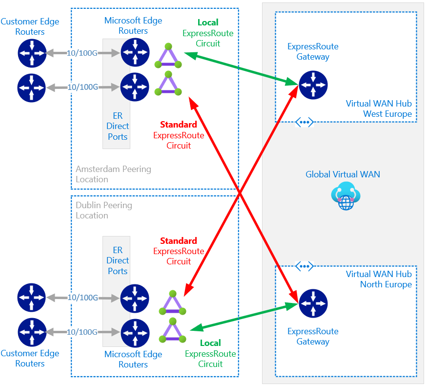
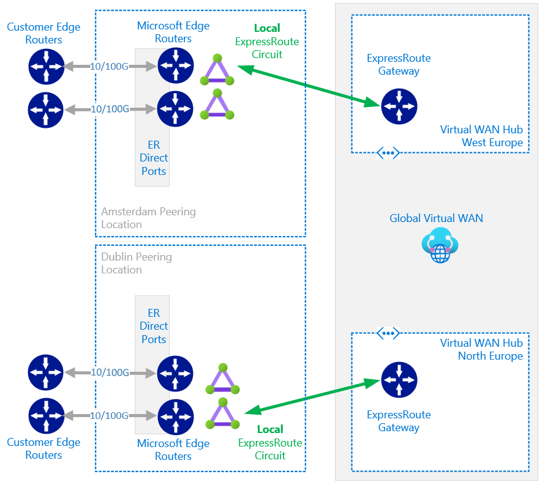

# 1. Combine ExpressRoute Direct and ExpressRoute Local

<!-- TOC -->

- [1. Combine ExpressRoute Direct and ExpressRoute Local](#1-combine-expressroute-direct-and-expressroute-local)
- [2. Introduction](#2-introduction)
    - [2.1. Good pre-reading/watching](#21-good-pre-readingwatching)
    - [2.2. ExpressRoute Direct](#22-expressroute-direct)
    - [2.3. ExpressRoute Local](#23-expressroute-local)
    - [2.4. Better together](#24-better-together)
- [3. Technical Design](#3-technical-design)
    - [3.1. Traditional Bowtie topology](#31-traditional-bowtie-topology)
    - [3.2. Modified Direct/Local Bowtie topology](#32-modified-directlocal-bowtie-topology)
    - [3.3. Traffic Engineering](#33-traffic-engineering)
        - [3.3.1. Normal Condition / BAU](#331-normal-condition--bau)
        - [3.3.2. Example Failure Scenario](#332-example-failure-scenario)
    - [3.4. Virtual WAN based topology options](#34-virtual-wan-based-topology-options)
        - [3.4.1. Virtual WAN modified Bowtie](#341-virtual-wan-modified-bowtie)
        - [3.4.2. Virtual WAN Local only](#342-virtual-wan-local-only)
    - [3.5. Considerations](#35-considerations)
- [4. Conclusion](#4-conclusion)

<!-- /TOC -->

# 2. Introduction

## 2.1. Good pre-reading/watching

It is assumed the reader is familiar with Azure networking constructs such as Regions, Peering Locations and ExpressRoute components. If not:

- Overview video by John Savill [here](https://www.youtube.com/watch?v=oevwZZ1YFS0)
- Overview article by Aidan Finn [here](https://aidanfinn.com/?p=22267)
- What is ER Direct by Charley Wen [here](https://youtu.be/0wsQrP6cAB8?t=387)
- Introduction of ExpressRoute Local by Yousef Khalidi [here](https://youtu.be/G9OrulBJTcE?t=960)

<PG video>

## 2.2. ExpressRoute Direct 

Many customers on Azure leverage ExpressRoute for reliable hybrid connectivity. Sometimes these same customers have requirements that make  the [ExpressRoute Direct](https://docs.microsoft.com/en-us/azure/expressroute/expressroute-erdirect-about) [connectivity model](https://docs.microsoft.com/en-us/azure/expressroute/expressroute-connectivity-models) the correct design choice. Typical drivers for ExpressRoute Direct include:

- Regulation or security requirements (MacSec)
- Big Data Hybrid connectivity bandwidth in excess of 10Gbps (Up to 100Gbps). Examples include:
  - Large data egress to On-Premises (E.g. Self-driving cars)
  - Large data egress to another cloud provider, E.g. [direct interconnection between Azure and Oracle Cloud Infrastructure](https://docs.microsoft.com/en-us/azure/virtual-machines/workloads/oracle/configure-azure-oci-networking)
  - VDI solutions on Azure
  - High bandwidth specialized workloads such as SAP on Azure
- Attachment of complicated multi-VRF MPLS IPVPN/WAN
- Simplification of connectivity design, logistics and commercial agreements

## 2.3. ExpressRoute Local

As per [here](https://docs.microsoft.com/en-us/azure/expressroute/expressroute-faqs#what-is-expressroute-local)

> ExpressRoute Local is a SKU of ExpressRoute circuit, in addition to the Standard SKU and the Premium SKU. A key feature of Local is that a Local circuit at an ExpressRoute peering location gives you access only to one or two Azure regions in or near the same metro...

> ...While you need to pay egress data transfer for your Standard or Premium ExpressRoute circuit, you don't pay egress data transfer separately for your ExpressRoute Local circuit. In other words, the price of ExpressRoute Local includes data transfer fees.

## 2.4. Better together

In this article we will show how its possible to combine these two ExpressRoute products, Local and Direct, and align with the common "Bowtie" [design pattern](https://docs.microsoft.com/en-us/azure/expressroute/designing-for-disaster-recovery-with-expressroute-privatepeering#large-distributed-enterprise-network) used by the majority of enterprise customers on Azure. 

This combination is, at first, not obvious, and hence this article was created. It shows how we able to maintain a highly resilient design, whilst benefiting from the pricing model of ExpressRoute Local to reduce egress costs. This may or may not be the right solution for your company, it depends on how much value you will derive from the pricing discounts, vs the downsides of the technical considerations laid out herein.

> **Note! The use of ExpressRoute local is particular of interest when utilising ExpressRoute Direct due to the fact that Local and Standard circuits are included in the base ExpressRoute Direct [port costs](https://azure.microsoft.com/en-gb/pricing/details/expressroute/).**

# 3. Technical Design

## 3.1. Traditional Bowtie topology

The following diagram shows how the typical enterprise bowtie design would be deployed to mesh two regions with two resilient ExpressRoute peering locations. This is the model used by most Enterprise customers using the partner connectivity models, and can be equally implemented within the framework of ExpressRoute Direct. This is a valid connectivity pattern, and is the right choice for some scenarios, see technical considerations section.

The commercial impact is that these are standard ExpressRoute circuits, and therefore any data leaving Azure towards On-Premises incurs costs as per _Outbound Data Transfer pricing_ [here](https://azure.microsoft.com/en-gb/pricing/details/expressroute/).

## 3.2. Modified Direct/Local Bowtie topology

Leveraging the logical, circuit, to physical, port, framework of ExpressRoute Direct we are able to deploy additional circuits both quickly and without additional cost to achieve the design below.

This delivers upon the same expected uptime of the traditional bowtie design, with the added benefit of free data egress when leaving Azure towards On-Premises via a green ExpressRoute Local circuit.

The important call-out here (outside of the technical considerations laid out later), is that **standard SKU ExpressRoute circuits as still needed for DR connectivity to remote regions**. (Remember that Local SKU circuits can [only be used to reach the Local Azure region](https://docs.microsoft.com/en-us/azure/expressroute/expressroute-faqs#what-features-are-available-and-what-are-not-on-expressroute-local)). However, with specific traffic engineering, these circuits are configured to be only used during a failure scenario.

> Good to know. Do you need to know which Azure region is classified as the "local" region for a specific peering location? Checkout the [ExpressRoute partners and peering locations documentation page](https://docs.microsoft.com/en-us/azure/expressroute/expressroute-locations-providers).  Notice the _Local Azure regions_ column [here](https://docs.microsoft.com/en-us/azure/expressroute/expressroute-locations-providers#global-commercial-azure).

## 3.3. Traffic Engineering

:bulb: Good to know. We cover this in more detail in the following places:

- [Designing for disaster recovery with ExpressRoute private peering](https://docs.microsoft.com/en-us/azure/expressroute/designing-for-disaster-recovery-with-expressroute-privatepeering)
- [Multi-Circuit Expressroute Private Peering Configurations- BGP AS PAth Prepending/Local Preference](https://github.com/jwrightazure/lab/tree/master/Expressroute-Multicircuit-ASprepend-Localpref) by @jwrightazure
- [ER Circuit migration](https://github.com/adstuart/azure-expressroute-migration)

### 3.3.1. Normal Condition / BAU

As stated above, we want to utilise the green ER Local circuits under normal conditions to benefit from their free egress costs. We will keep the ingress/egress symmetrical to reduce any further complexities (stateful firewalls etc). To do this we utilise normal ExpressRoute BGP traffic controls to preference the local circuit, and local peering location, for ingress/egress to the local region.

E.g. In the diagram below, the customers WAN directs traffic to the Amsterdam Peering location for traffic destined to Azure West Europe. The Gateway in Azure West Europe then instructs the components within the Azure West Europe Virtual Networks to utilise the Amsterdam ER Local circuit when sending traffic in the opposite direction.

This is typically achieved with a combination of BGP metrics including Weight, As-path-prepend and Local Preference, see links above for a deep dive on these subjects.

### 3.3.2. Example Failure Scenario

To highlight why the ExpressRoute standard circuits are needed, and when they will be used, lets take an example failure scenario. If the Amsterdam peering exchange has a complete failure (both customer or Microsoft Edge routers within this facility go offline), this effectively becomes unusable as a connectivity path to West Europe.

Under these conditions, the backup peering location in Dublin can be used for connectivity to the West Europe region. This happens automatically if circuits and gateways are connected as per this design, and within the timescales of typical BGP failover (hold timers, BFD, etc). 

In this scenario, the ExpressRoute standard circuit is used, as this is connectivity from a peering location to a remote region. During the time period when this connectivity pattern is used (until the Amsterdam PoP is restored) any data that leaves Azure West Europe, via the Dublin PoP, will incur egress costs due to use of the standard SKU circuit.

## 3.4. Virtual WAN based topology options

The combination of ExpressRoute Direct and ExpressRoute Local [can also](https://docs.microsoft.com/en-us/azure/virtual-wan/virtual-wan-expressroute-portal#:~:text=transit%20capabilities.%20ExpressRoute-,Local,-is%20also%20supported) be applied to scenarios utilising Azure Virtual WAN as [opposed](https://docs.microsoft.com/en-us/azure/cloud-adoption-framework/ready/azure-best-practices/define-an-azure-network-topology) to a traditional customer-managed hub/spoke network. 

Due to Virtual WAN's [transitive](https://docs.microsoft.com/en-us/azure/virtual-wan/virtual-wan-global-transit-network-architecture) hub-to-hub routing properties, we have two posable topologies, each with slightly different routing behaviour during failure scenarios.

### 3.4.1. Virtual WAN modified Bowtie

- Same connectivity pattern with combination of ExpressRoute Local and ExpressRoute Standard SKU circuits
- Same routing / cost logic applies as per section 3.1-3.3
- No dependency on VWAN hub-to-hub routing for peering location to remote region routing. E.g. If Azure North Europe Virtual WAN Hub has loss of service, assuming the Dublin Peering location is still online, traffic could still enter Microsoft Network in Dublin and traverse backbone to Azure West Europe
- :warning: Be aware of considerations for "Azure to Azure inter-region traffic" in respect to this pattern. Click [here](https://docs.microsoft.com/en-us/azure/virtual-wan/virtual-wan-faq#when-two-hubs-hub-1-and-2-are-connected-and-there-is-an-expressroute-circuit-connected-as-a-bow-tie-to-both-the-hubs-what-is-the-path-for-a-vnet-connected-to-hub-1-to-reach-a-vnet-connected-in-hub-2) to learn more

### 3.4.2. Virtual WAN Local only

- **This "non Bowtie" Local-only pattern is unique to Virtual WAN**
- Azure Virtual WAN differs from customer-managed hub/spoke networking in Azure, in respect to this connectivity pattern. I.e. in the diagram above, the customer edge routers in **both** Dublin _and_ Amsterdam recieve prefixes for all VNets connected to the Global Virtual WAN -- _either peering location can still be used for connectivity to both regions, even though the ExpressRoute circuits are **not** meshed/bowtied._
- Same routing logic applies as per section 3.1-3.3 (BGP control)
- ExpressRoute egress bandwidth is never charged, however, in a failure scenario, if the Virtual WAN Hub-to-hub routing feature is used (E.g. Customer WAN > Dublin PoP > North Europe Hub > West Europe Hub) then inter-region bandwidth [charges](https://azure.microsoft.com/en-gb/pricing/details/bandwidth/) apply.

## 3.5. Considerations

- ExpressRoute GlobalReach is [not available](https://docs.microsoft.com/en-us/azure/expressroute/expressroute-faqs#what-features-are-available-and-what-are-not-on-expressroute-local) on Local SKU circuits. If you plan to make use of GlobalReach for global connectivity scenarios, and/or, connectivity to workloads such as [Azure VMware Solution](https://docs.microsoft.com/en-us/azure/azure-vmware/tutorial-expressroute-global-reach-private-cloud) and [Skytap](https://help.skytap.com/wan-expressroute-overview.html), this pattern should be approached with care (I.e. you will need to only use the ER standard circuits for GlobalReach onwards connectivity to AVS/Skytap).
- ExpressRoute hairpin. Some customers may utilise the routing properties of an ER circuit to route traffic between Azure Regions. I.e. if you connect two ExpressRoute Gateways to the same ExpressRoute circuit, [traffic will flow between them](https://cloudnetsec.blogspot.com/2019/02/azure-intra-region-and-inter-region.html). If you follow the pattern described in this guide, you utilise separate circuits and therefore remove this behaviour. **Please note, if you have requirements to route traffic between Azure Regions, it is always recommended to utilise Global VNet peering (or Azure Virtual WAN), and not ER Hairpin, for this traffic**.
- Gateway Limits. This design inherently increases the number of logical circuits used, ensure you are within ExpressRoute Gateway [limits](https://docs.microsoft.com/en-us/azure/expressroute/.
expressroute-about-virtual-network-gateways#gatewayfeaturesupport).

> :bulb: Good to know. Although outside of the scope of this article, please familirise yourself with ExpressRoute **FastPath** if you are unaware with this terminology. This often goes hand-in-hand with discussions related to high bandwidth use of ExpressRoute. https://aka.ms/erfastpath

- Circuit limits. By default, you can [create 50 circuits](https://docs.microsoft.com/en-us/azure/expressroute/how-to-expressroute-direct-portal#circuit) in the subscription where the ExpressRoute Direct resource is.
- Review [ExpressRoute Premium](https://docs.microsoft.com/en-us/azure/expressroute/expressroute-faqs#what-is-expressroute-premium) features, if you are making use of these features today, Local may not work for you. Please note, ExpressRoute Premium SKU circuits incur additional cost beyond the base ExpressRoute Direct port charges.
- This design is predicated on the idea that data flows ingress/egress at the peering location closest to the Azure region, I.e. you utilise your own MPLS WAN to get traffic to the closest Microsoft Edge ([cold potato](https://en.wikipedia.org/wiki/Hot-potato_and_cold-potato_routing#:~:text=to%20the%20telco.-,Cold-potato%20routing,-%5Bedit%5D) from the perspective of your network). If you wish to follow a [hot potato](https://en.wikipedia.org/wiki/Hot-potato_and_cold-potato_routing#:~:text=References-,Hot-potato%20routing,-%5Bedit%5D) pattern, and maximise use of the Microsoft global network then this pattern is best avoided. 

Finally, if these technical constraints prevent you from benefiting from ExpressRoute Local egress pricing for you entire Azure design, it should not stop you considering it for specific workloads. For example, if you have a future requirement for a high-bandwidth workload (E.g. SAP, BigData, VDI) that is able to reside within a single region, there is nothing stopping you complimenting your existing design with a "sidecar" use of ExpressRoute Local. E.g.

# 4. Conclusion

We learnt that ExpressRoute Direct customers are able to leverage the pricing attributes of ExpressRoute Local SKU circuits whilst at the same time maintaining an Enterprise grade resilient hybrid connectivity pattern. We highlighted the key considerations when assessing if this pattern is appropriate for your use of Azure.
